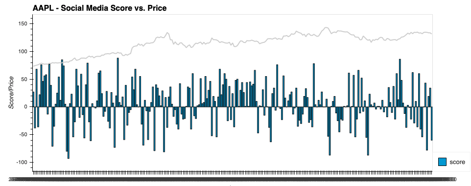
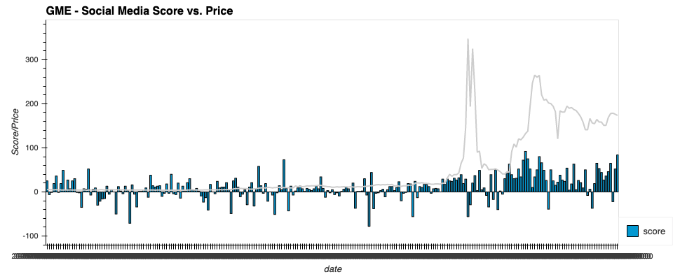
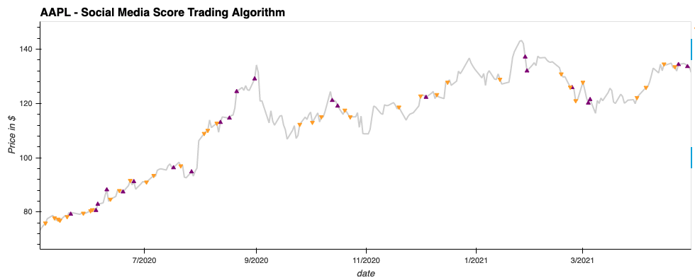
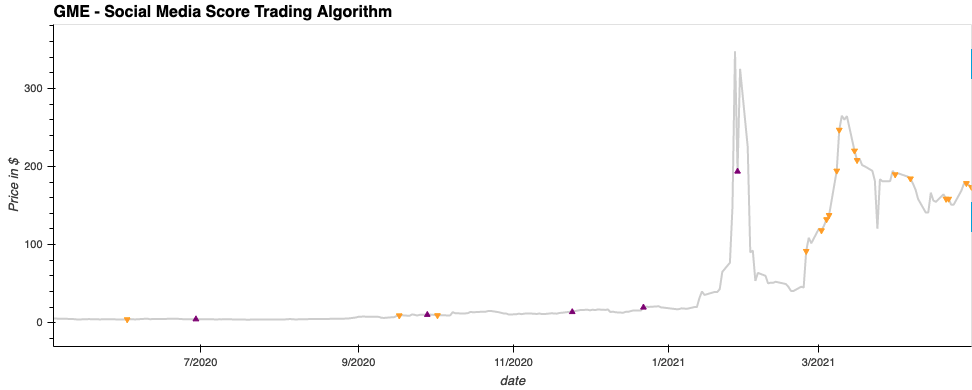
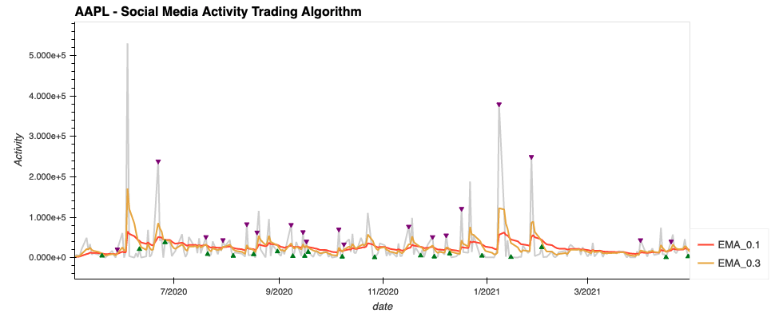
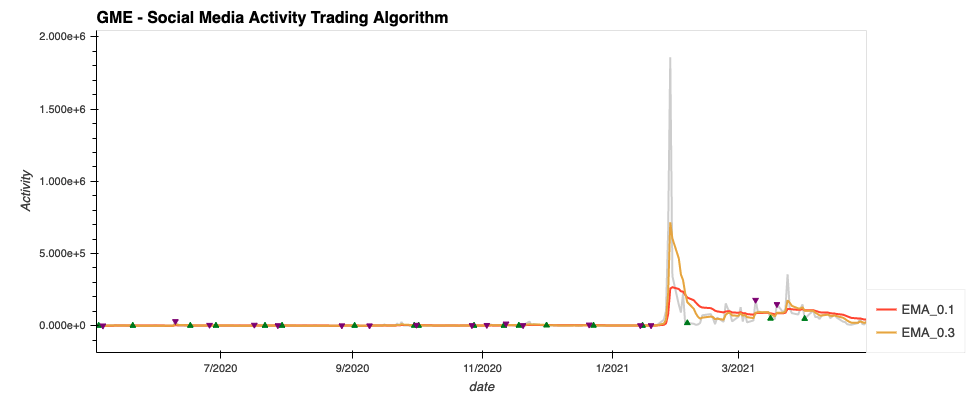
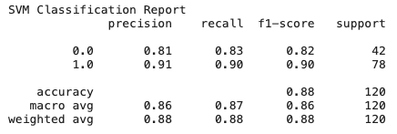
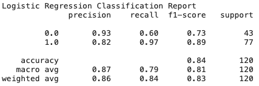

# Social Media Bets

---

## Description
We as human species have entered a new generation where information is so efficiently and quickly exchanged that we can move prices of companies. With the expansion of social media, and the amount information that can be disseminated in the span of a few minutes, we decided test our thesis of using alternative indicators as well as traditional measures such as dual moving crossover average. In this tool we tested to see if we can use social sentiment to make investment decisions. 

## Key questions 

* Is there a correlation between public sentiment(score) and price? 
* Is there a correlation between social media activity and price movement of a company?
* Can we add alpha and investment returns from these alternative indicators?

## Usage
Use alternative trading indicators and machine learning to find alpha strategies

## Installation Guides / Import libraries and dependencies
import os,
import requests,
import json,
import pandas as pd,
from datetime import date,
from dotenv import load_dotenv,
from pathlib import Path,
import numpy as np,
import hvplot.pandas,
import matplotlib.pyplot as plt,
%matplotlib inline,
import seaborn as sns,
from sklearn import svm,
from sklearn.preprocessing import StandardScaler,
from pandas.tseries.offsets import DateOffset,
from sklearn.metrics import classification_report,
from sklearn.linear_model import LogisticRegression,
from sklearn.tree import DecisionTreeClassifier,
from sklearn.ensemble import AdaBoostClassifier

## Sources / Inputs
* API from YahooFinance for historical prices for ticker
* API from publicsentiment IO which scrapes the web for social media posts such as twitter, reddit and news outlets. Pull public sentiment which was defined by a score as well as activity level of each company.  Using this data we decided to test various stocks, time periods, and use different models to test for accuracy.

    * Historical pricing data for ticker
    * Historical Social Media Score for ticker
    * Historical Social Media Activity for ticker

## Consolidate Data and Convert to Dataframe and Create Visuzliations to find Trends/Correlation

## Algorithm

### Social Sentiment - Score & Activity vs. Price

       *  Social Media Score - social score  ranges from -100 to 100. A score of -100 indicates that there were significantly negative sentiment on that company that day and a positive score of 100 indicates there were optimistic sentiments. This variable is finite and within a range.

          ** Contrarian and Leading Indicator - We used a contrarian strategy to buy when there was a significantly negative score defined by negative 50 or greater and to sell if there was score of 50 or greater which may indicate a peak. 
          

    
       * Social Media Activity - social media activity scrapes the web for shares, likes, posts of a company. This variable is continuous and can be infinit (0 to infinity)

           ** Dual Moving Average -- We used exponential moving average to indicate a buy/sell signal. When the lower smoothing factor (alpha = 0.1) exceeded higher smoothing factor (alpha = 0.3). 

       * Price - historical price of a stock for trailing 1 year. This variable is continuous and can be infinit (0 to infinity)

### Backtest Algorithm 
Backtested hypothetical scenarios using $100,000 initial capital and 100 shares
* Findings: Some stocks showed less correlation between public sentiment and price (i.e Apple) whereas some showed creater correlation at times such (i.e Gamestop). We believe this to be due to numerous external factors such as seasonal so if there was an earnings report or product launch that will have an impact on the time period we are using. As well as lack of social media presence. If a CEO is on social media like Elon Musk, versus a CEO that is not as active on social media that can have an impact as well. 

### Machine Learning 
Test accuracy of models using SVM and Logistic Regression and backtest

AAPL Logistic Regression Model - Classification Report

---
GME Logistic Regression Model - Classification Report

---

## License

